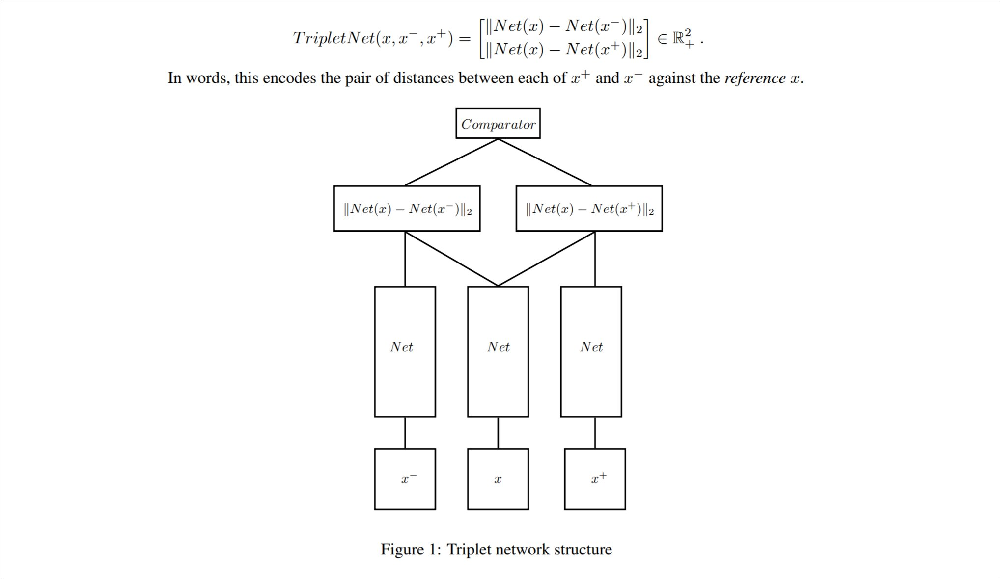
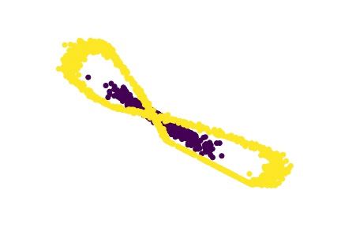

# Simple triplet network experiments

In this repo I tried to construct couple simple [triplet networks](https://arxiv.org/abs/1412.6622) experiments to gain better intuition on how they work.

Triplet network is a simple and intuitive embedding idea whtich tries to decrease distance between samples from class A ($x$ and $x^{+}$) and increase distance from $x$ to class B ($x^{-}$).

### Input

To get better intuitive understanding I took two class example of encircled point cloud and tried to fit triplet network. Total of 2000 points (1000 of each class).

### Net

As a network I have used two layer linear NN. First layer - (2, 8), second one - (8, 2) and dropout of 0.4 in between.

### Training process

Training on batches consisting of 150 points using SGD optimizer leads to following result after 5000 iterations.

